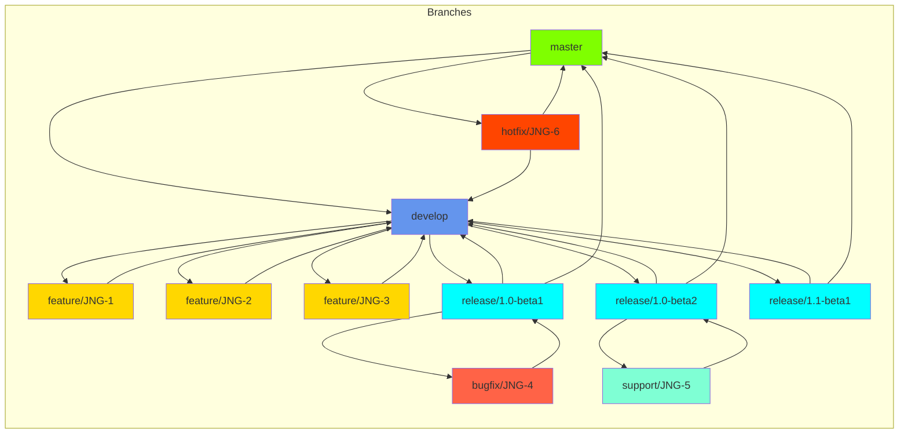
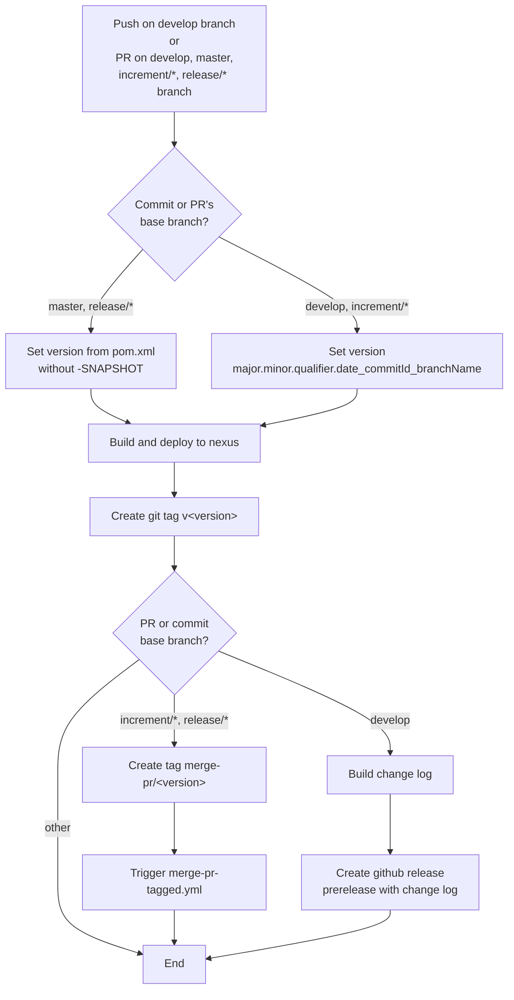
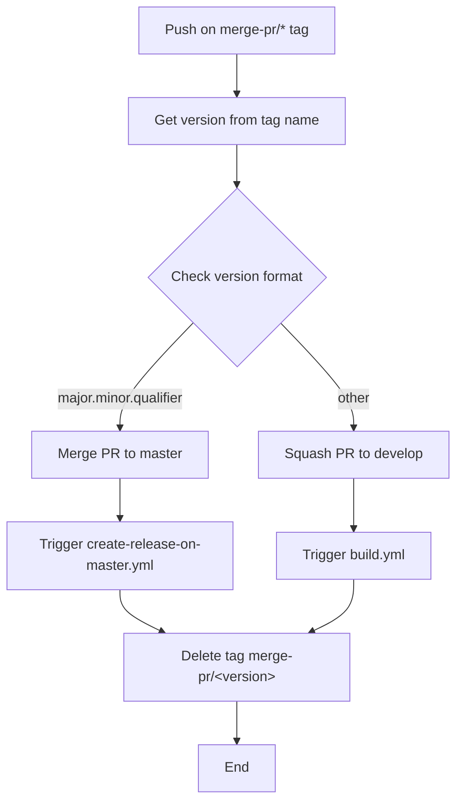
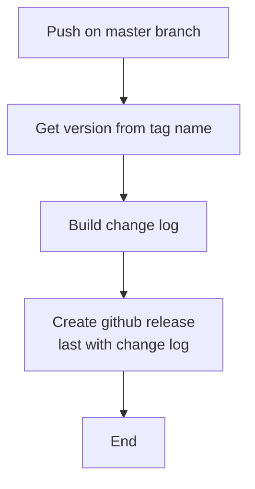
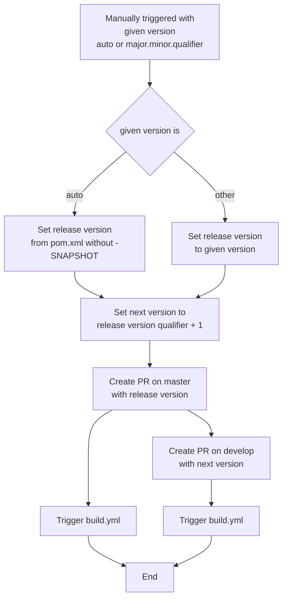

# Development version and branch handling

## Table of Contents

- [Branches](#branches)
- [Version numbers](#version-numbers)
- [How to develop](#how-to-develop)

## Branches

Versioning policy of JUDO NG modules are based on GitFlow: https://www.atlassian.com/git/tutorials/comparing-workflows/gitflow-workflow.

Branches:

* **develop**: development branch contains latest development sources of the last active version
* **feature/JNG-NUMBER_short_summary**: feature branches are based on **develop** and contains sources of new features that will be included in last active version
* **(release/)1_0_beta1**: release branches of 1.0-beta1 (release/ prefix is still reserved for CI)
* **bugfix/JNG-NUMBER_short_summary**, **support/JNG-NUMBER_short_summary**: bugfix and support branches are based on release branches and must be applied to release and development branches of newer versions too
* **master**: contains latest released sources of the last active version

## Version numbers

Version numbers are increased using semantic versioning:

* do not change version numbers on starting feature/ branches
* 2nd number in version of **develop** branch is increased when a release branch started
* do not change version numbers on bugfix/ branches - that are applied on release branches during testing before releasing it (merging to master)
* 3rd number in version of support/ branches is increased when started - it is used to support a previous release including new (minor) changes; support/ branches are merged back to release branch when update is released (without merging changes to master)
* 4th number in version of hotfix/ branches is increased when started (that are applied on both release and master branches)

### GitHub action flows

#### build.yml

#### merge-pr-tagged.yml

#### create-release-on-master.yml

#### release.yml

## How to develop

For issue tracking we are using [JIRA](https://blackbelt.atlassian.net/jira/dashboards). Golden rule:

> **Important:** There is no commit without ticket number

So for pull request or commit `JNG-xxx` have to be presented in the commit.
