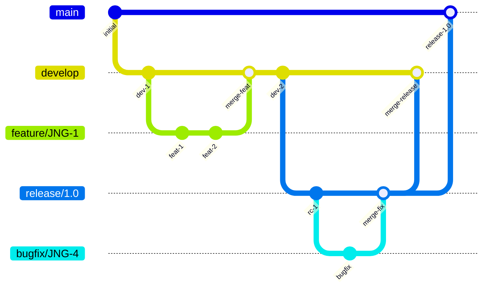
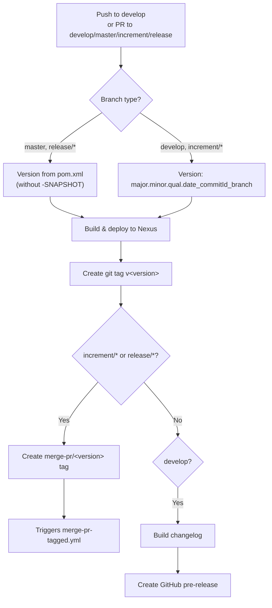
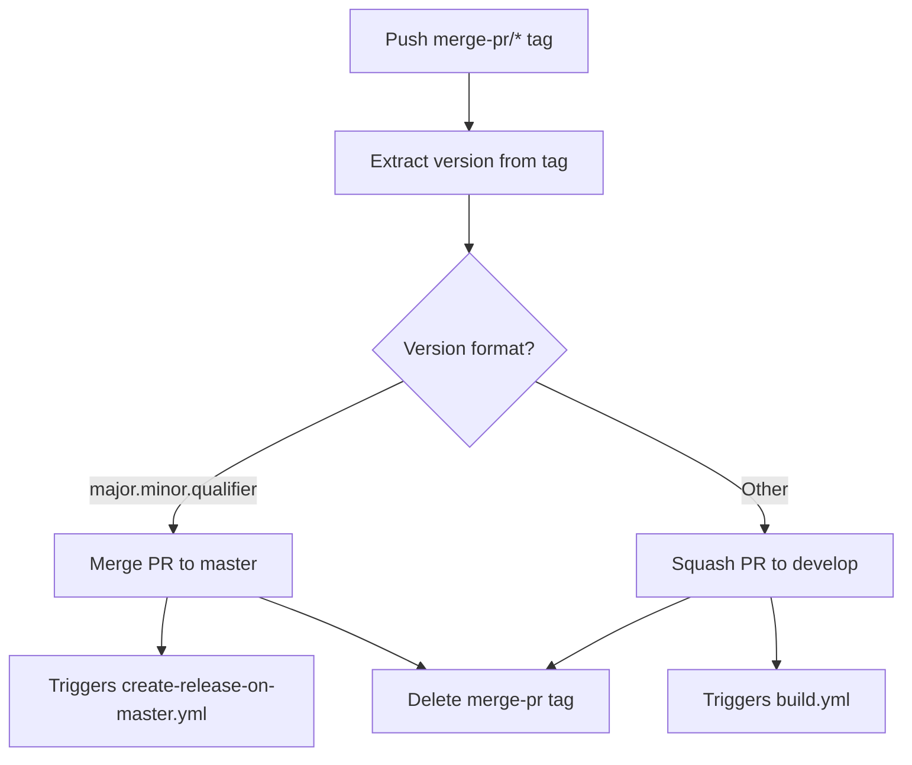
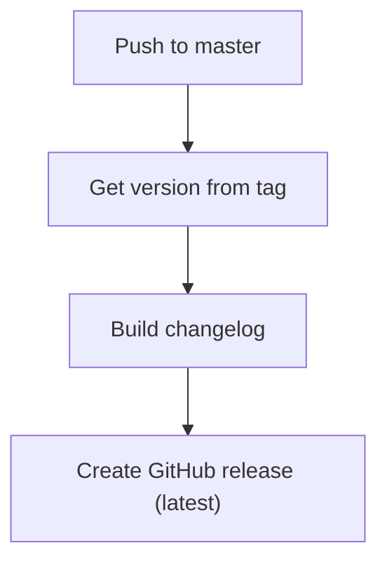
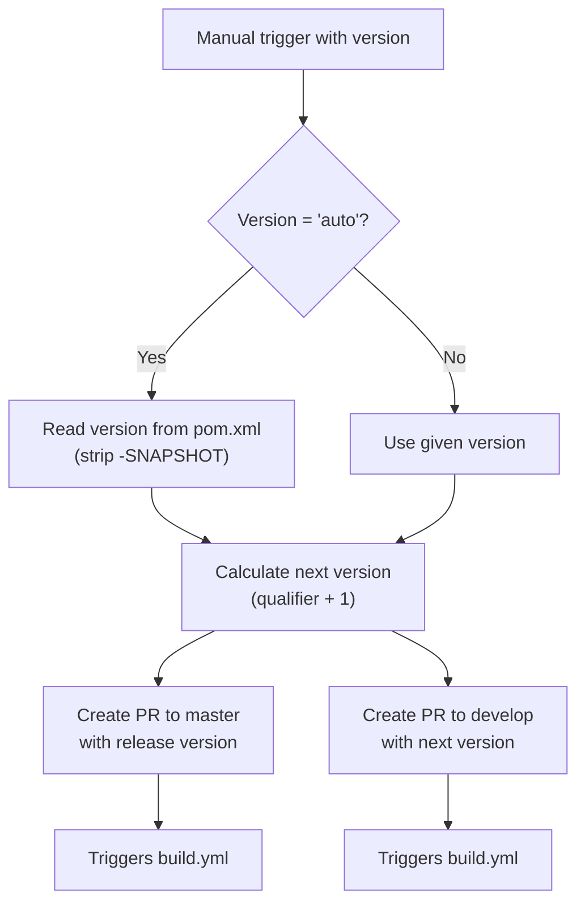
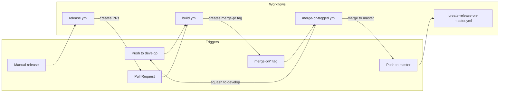

# Development Version and Branch Handling

## Branching Strategy

The JUDO NG modules follow a **GitFlow**-based branching and versioning policy ([see tutorial](https://www.atlassian.com/git/tutorials/comparing-workflows/gitflow-workflow)).

### Branch Types

| Branch | Pattern | Purpose |
|--------|---------|---------|
| **develop** | `develop` | Latest development sources for the active version |
| **feature** | `feature/JNG-NNN_short_summary` | New features, branched from `develop` |
| **release** | `release/x.y.z` or `x_y_betaN` | Stabilization branches for upcoming releases |
| **bugfix** | `bugfix/JNG-NNN_short_summary` | Fixes on release branches; must be applied to all newer versions |
| **support** | `support/JNG-NNN_short_summary` | Minor changes to previous releases; merged back to the release branch |
| **hotfix** | `hotfix/JNG-NNN_short_summary` | Urgent fixes applied to both release and `master` branches |
| **master** | `master` | Latest released sources |

### Branch Lifecycle

## Version Numbers

Versions follow **semantic versioning** with these rules:

| Scenario | Version Change |
|----------|---------------|
| Starting a **feature** branch | No change |
| Starting a **release** branch | 2nd number incremented on `develop` |
| Starting a **bugfix** branch | No change (applied to release branches before release) |
| Starting a **support** branch | 3rd number incremented |
| Starting a **hotfix** branch | 4th number incremented |

## GitHub Actions CI/CD Workflows

The project uses several interconnected GitHub Actions workflows. Issue tracking uses [JIRA](https://blackbelt.atlassian.net/jira/dashboards).

> **Important:** Every commit and pull request must reference a JIRA ticket number (`JNG-xxx`).

### build.yml — Main Build Pipeline

Triggered on pushes to `develop` and pull requests targeting `develop`, `master`, `increment/*`, or `release/*`.

### merge-pr-tagged.yml — Auto-merge Handler

Triggered when a `merge-pr/*` tag is pushed.

### create-release-on-master.yml — Release Publisher

Triggered when code is pushed to `master`.

### release.yml — Release Creator

Manually triggered with a version parameter (either `auto` or `major.minor.qualifier`).

### Other Workflows

| Workflow | Purpose |
|----------|---------|
| `bump-version.yml` | Bumps version on release branches |
| `create-release-tagged.yml` | Creates releases from tags |
| `build-dependabot.yml` | Handles Dependabot PRs |
| `jira-description-to-pr.yml` | Copies JIRA ticket descriptions into PR bodies |
| `delete-old-draft-releases.yml` | Cleans up draft releases |
| `sync-labels.yml` | Synchronizes issue labels |

## Workflow Interaction Overview

