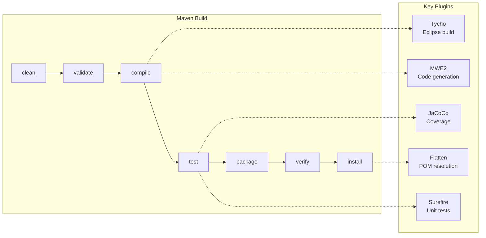
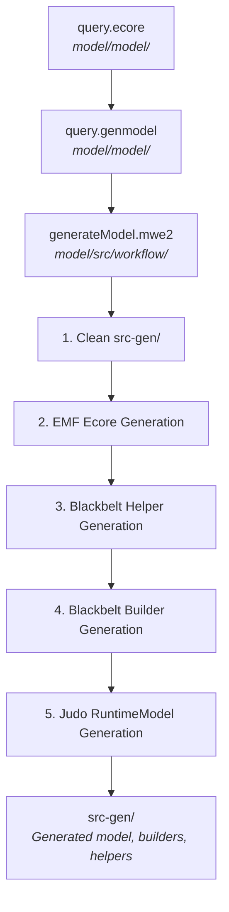

# Contributing to JUDO

## Development Environment

Make sure your development environment meets these requirements (detailed in the [judo-community CONTRIBUTING guide](https://github.com/BlackBeltTechnology/judo-community/blob/develop/CONTRIBUTING.adoc)):

- **Java 21** JDK
- **Maven 3.9.4+** (or use the included `./mvnw` wrapper)

## Project Structure

This project is a multi-module Maven build that uses **Tycho** for Eclipse integration. The modules serve different purposes:

### Model Modules

| Module | Type | Description |
|--------|------|-------------|
| `model/` | eclipse-plugin | Core EMF Ecore metamodel (`model/query.ecore`), generated Java classes (`src-gen/`), hand-written runtime utilities (`src/main/java/`), and Epsilon validation rules (`src/main/epsilon/`) |
| `model-test/` | jar | JUnit 5 tests for model validation, execution context, and model loading |

### Eclipse Distribution Modules

| Module | Type | Description |
|--------|------|-------------|
| `feature/` | eclipse-feature | Eclipse feature definition for plugin installation |
| `site/` | eclipse-repository | Eclipse P2 update site — all built versions are compiled as an update site |

> **Note:** The JUDO update sites encode versions in their URLs. Since Tycho loads the category definition as an extension before version resolution, a special profile exists to update category versions:
>
> ```bash
> mvn clean install -P update-category-versions -f site/pom.xml
> ```

### OSGi Modules

| Module | Type | Description |
|--------|------|-------------|
| `osgi/` | bundle | Repackages the model with additional OSGi services/metadata for use in transformation pipelines outside Eclipse |
| `osgi-itest/` | jar | Integration tests using Pax Exam with a Karaf 4.4.7 container |

## Build Lifecycle



### Build Commands

```bash
# Full build
./mvnw clean install

# Tests only
./mvnw clean test

# Single test class
./mvnw test -pl model-test -Dtest=QueryValidationTest

# Skip tests
./mvnw clean install -DskipTests

# Code coverage report
./mvnw clean test jacoco:report
```

### Maven Profiles

| Profile | Purpose |
|---------|---------|
| `modules` | Active by default. Includes all submodules. Deactivate with `-DskipModules=true` |
| `sign-artifacts` | Signs built artifacts (used in CI releases) |
| `release-dummy` | Deploys to local `/tmp/` directory for testing |
| `release-judong` | Deploys to Judong Nexus snapshot repository |
| `release-central` | Deploys to Maven Central via Sonatype OSSRH |
| `generate-github-asciidoc-diagrams` | Generates PNG diagrams from AsciiDoc PlantUML blocks |
| `update-source-code-license` | Updates EPL-2.0 license headers in source files |

## Code Generation

The model Java code is generated from the Ecore metamodel using an MWE2 (Modeling Workflow Engine 2) workflow.



**Generated output** lands in `model/src-gen/`. Key generated packages:

| Package | Contents |
|---------|----------|
| `hu.blackbelt.judo.meta.query` | Model interfaces (Select, Join, Feature, etc.) |
| `hu.blackbelt.judo.meta.query.impl` | Implementation classes |
| `hu.blackbelt.judo.meta.query.util` | EMF switch/adapter utilities |
| `hu.blackbelt.judo.meta.query.util.builder` | Fluent builder API for creating model elements |
| `hu.blackbelt.judo.meta.query.support` | `QueryModelResourceSupport` — EMF ResourceSet factory |
| `hu.blackbelt.judo.meta.query.runtime` | `QueryModel` — fluent API for loading/saving models |

> **Warning:** Never manually edit files in `model/src-gen/`. Regenerate using the MWE2 workflow. In Eclipse: run `Generate JSL.launch` or execute `src/workflow/generateModel.mwe2` as an MWE2 Workflow.

## Validation

Model validation uses the **Epsilon Validation Language (EVL)**. Validation rules are in:

- `model/src/main/epsilon/validations/query.evl` — model-level constraints
- `model/src/main/epsilon/validations/query-plugin-validation.evl` — Eclipse plugin-level constraints

The `QueryEpsilonValidator` class runs these rules programmatically. It sets up an Epsilon `ExecutionContext` with the model wrapped as a named resource (`"QUERY"`) and injects `QueryUtils` as a helper.

## Working with Eclipse

### Required Plugins

- **m2e** (Maven integration)
- **Epsilon** (model validation)
- **Modeling Tools** (EMF editors)

For code generation, also install: **Xtext**, **MWE**, **MWE2**

### Installation

Install the plugin via P2 update sites: go to "Install New Software" in Eclipse, add the URL from the GitHub release, or point to an uncompressed site ZIP.

### Known Issues

| Issue | Workaround |
|-------|------------|
| JUnit not on classpath in Eclipse | A `Required-Bundle` entry for JUnit has been added to the OSGi Manifest (not the Tycho-recommended approach). See [Eclipse Bug 534587](https://bugs.eclipse.org/bugs/show_bug.cgi?id=534587). |
| Lombok not supported by Tycho | No Lombok is used in Eclipse plugin modules. All source in `model/` is either hand-written without Lombok or generated. See [Lombok Issue 285](https://github.com/rzwitserloot/lombok/issues/285). |
| Tycho repository references | Tycho 1.4.0 and below did not handle repository references inside site definitions. All referenced P2 sites must be added manually. See [Eclipse Bug 453708](https://bugs.eclipse.org/bugs/show_bug.cgi?id=453708). |

## Version Policy

Maven and Eclipse have different version conventions. This project bridges them using the **Tycho Versions Plugin**:

| Convention | Example | Used By |
|-----------|---------|---------|
| Maven SNAPSHOT | `1.0.3-SNAPSHOT` | Maven modules, CI |
| Eclipse qualifier | `1.0.3.qualifier` | Eclipse plugin, feature, site |

The `revision` property in the root `pom.xml` controls the version (currently `1.0.3-SNAPSHOT`). Tycho replaces `.qualifier` with a timestamp-based qualifier during builds.

## Submission Guidelines

### Submitting an Issue

Before submitting, search the [issue tracker](https://github.com/BlackBeltTechnology/judo-meta-query/issues) for existing reports. Include:

- Output of `java -version`, `mvn -version`
- Relevant `pom.xml` or `.flattened-pom.xml`
- A minimal reproducible use case

### Submitting a PR

This project follows [GitHub's standard forking model](https://guides.github.com/activities/forking/). Fork the project, create a feature branch, and submit a pull request.
