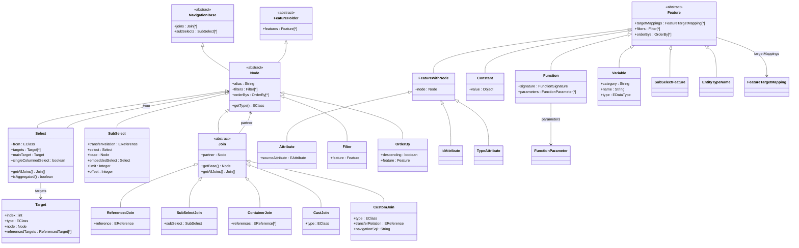
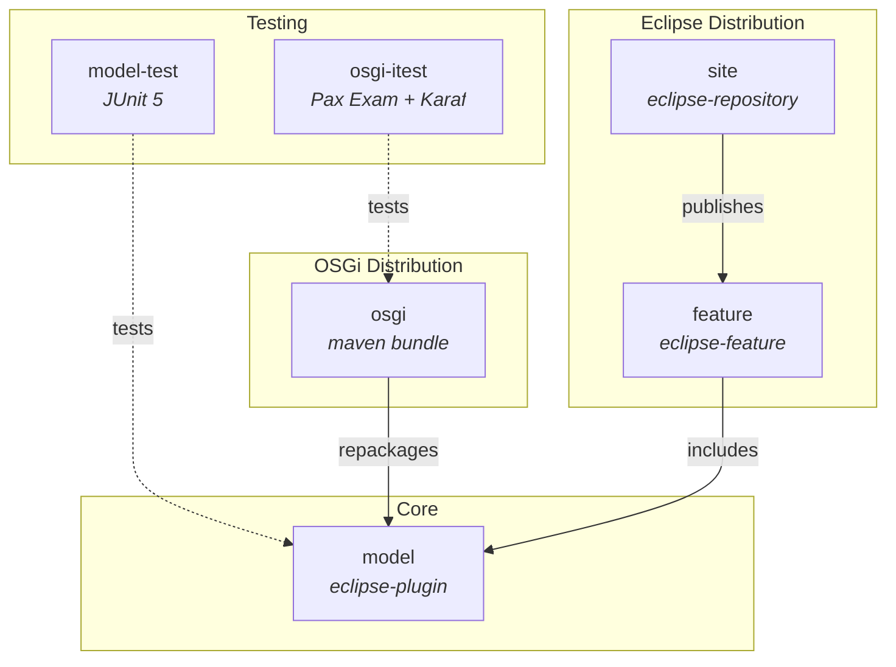

# judo-meta-query

[](https://github.com/BlackBeltTechnology/judo-meta-query/actions/workflows/build.yml)

## Introduction

**judo-meta-query** defines the Query metamodel — an EMF (Eclipse Modeling Framework) Ecore model that represents expression-based transformation logic for queries. This is **not** an SQL model; instead, it captures the structural and logical relationships needed to later generate RDBMS queries.

The project can be consumed in three ways:

- As an **Eclipse plugin** with features and update site
- As a **standalone Java library** (Maven artifact)
- As an **OSGi bundle** for non-Eclipse service containers

This project is a building block of the [judo-community](https://github.com/BlackBeltTechnology/judo-community) aggregator project. See that repository for how this module fits into the broader JUDO ecosystem.

## Query Metamodel Overview

The metamodel is defined in [`model/model/query.ecore`](model/model/query.ecore). Below is a summary of the core concepts and how they relate.

### Class Hierarchy



### Key Concepts

| Concept | Description |
|---------|-------------|
| **Node** | Abstract base for all query graph nodes. Returns an `EClass` entity type via `getType()`. Contains filters, orderBys, and an alias. |
| **Select** | Root query for an entity. Has a `from` EClass, multiple `Target` projections, and one `mainTarget`. Each transfer object has one relevant Select. |
| **SubSelect** | A runtime query that navigates relations via `transferRelation`. The `base` field is the navigation starting point. Can contain an `embeddedSelect` as a workaround when a Select isn't available from transfer objects. Supports `limit`/`offset` for pagination. |
| **Join** | Abstract join specification. `getBase()` recursively walks the `partner` chain to find the root node. Five concrete types: `ReferencedJoin` (follows an EReference), `SubSelectJoin` (wraps a SubSelect), `ContainerJoin` (navigates containment), `CastJoin` (type casting), `CustomJoin` (custom SQL navigation). |
| **Feature** | Abstract class representing something a Select or Join returns (attributes, calculated values, constants). Mapped to result columns via `FeatureTargetMapping`. |
| **Target** | Projection descriptor that defines how to represent query results. Has an `index`, optional `type` (EClass), and `referencedTargets` for navigating to related targets. |
| **Filter** | Where-clause condition node, linked to a `Feature` that provides the filter expression. |
| **Function** | Represents a function call with a `FunctionSignature` enum (118+ operations covering logic, comparison, arithmetic, string, date, time, and type operations) and typed `FunctionParameter`s. |
| **Variable** | A query variable with `category`, `name`, and `type` — used for parameterized queries. |
| **SubSelectFeature** | A Feature used in "where" clauses that references a SubSelect and an aggregation Feature. |
| **EntityTypeName** | Used with inheritance to reference entity types by name. |

### Module Dependency Graph



## Build Commands

> **Prerequisites:** Java 21 JDK, Maven 3.9.4+. A Maven wrapper (`./mvnw`) is included.

```bash
# Full build (all modules)
./mvnw clean install

# Run tests only
./mvnw clean test

# Run a single test class
./mvnw test -pl model-test -Dtest=QueryValidationTest

# Skip tests
./mvnw clean install -DskipTests

# Update Eclipse site category versions
mvn clean install -P update-category-versions -f site/pom.xml
```

## Contributing

Everyone is welcome to contribute to JUDO! See [CONTRIBUTING.md](CONTRIBUTING.md) for development setup, code structure details, and submission guidelines.

## License

This project is licensed under the [Eclipse Public License - v 2.0](https://www.eclipse.org/legal/epl-2.0/).
