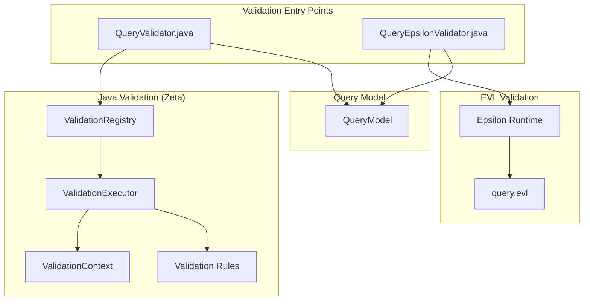

# Query Model Validation

This document provides an overview of the Query model validation system.

## Overview

The Query metamodel supports two validation engines:

1. **EVL (Epsilon Validation Language)** - The original validation engine using Epsilon
2. **Java (Zeta Framework)** - A native Java validation framework with better IDE support

Both validators can run in parallel, producing identical results. The Java validator provides:

- Full IDE integration (debugging, refactoring, autocomplete)
- Better performance for large models (parallel execution)
- Compile-time validation rule checking
- Easier testing and maintenance

## Quick Start

### Running Validation

```java
// Using Java validator
QueryValidator.validateQuery(log, queryModel);

// Using EVL validator
QueryEpsilonValidator.validateQuery(log, queryModel, scriptUri);
```

### Running Tests

```bash
# Run all validation tests (both EVL and Java)
mvn test -pl model-test

# Run performance tests
mvn test -pl model-test -Dtest=QueryValidationPerformanceTest
```

## Documentation

- [Java Validation Framework](java-validation-framework.md) - How to use and extend the Java validator
- [Query Validation Rules](query-validation-rules.md) - List of all implemented validation rules

## Architecture



## Current Status

The EVL validation rules are currently placeholder (TODO: JNG-4275). The Java validation infrastructure is in place and ready for rule implementation.

### Implemented Rules

None currently - see JNG-4275 for progress.

### Planned Rules

Based on the Query metamodel, the following validation rules are planned:

| Context | Constraint | Description |
|---------|------------|-------------|
| Select | SelectMustHaveFrom | Select must have a valid 'from' reference |
| Node | NodeMustHaveType | Node getType() must return valid EClass |
| SubSelect | SubSelectMustHaveBase | SubSelect must have base navigation |
| Join | JoinMustHaveBase | Join getBase() must be valid |
| Feature | FeatureMustHaveTarget | Feature must have target mapping |
| Function | FunctionMustHaveSignature | Function must have valid signature |

## See Also

- [Judo Zeta Validation Framework](https://github.com/BlackBeltTechnology/judo-zeta) - External Zeta documentation
- [Epsilon EVL Documentation](https://eclipse.dev/epsilon/doc/evl/) - EVL language reference
